[当日発表スライド](https://ishiijunpei.github.io/2019datasience/#/)

    # パッケージ読み込み
    library(tidyverse)
    library(ggthemes)
    library(knitr)
    library(rmarkdown)
    library(revealjs)

覚えるべき用語
==============

連続量

数字で表される属性です。土器の口径、器高、石器の刃部長や重量などです。

離散量

何らかの分類がなされ、記号で表される属性です。土器の分類、石器の器種などです。

連続量と離散量の組み合わせによる可視化手法
==========================================

可視化手法はデータの型とその組み合わせによって決まります。

    read.csv("data/method.csv")%>%kable()

<table>
<thead>
<tr class="header">
<th style="text-align: left;">変数1</th>
<th style="text-align: left;">変数2</th>
<th style="text-align: left;">可視化手法</th>
</tr>
</thead>
<tbody>
<tr class="odd">
<td style="text-align: left;">連続量</td>
<td style="text-align: left;"></td>
<td style="text-align: left;">ヒストグラム</td>
</tr>
<tr class="even">
<td style="text-align: left;">離散量</td>
<td style="text-align: left;"></td>
<td style="text-align: left;">棒グラフ</td>
</tr>
<tr class="odd">
<td style="text-align: left;">離散量</td>
<td style="text-align: left;">連続量</td>
<td style="text-align: left;">ファセットヒストグラム、密度図、箱ひげ図</td>
</tr>
<tr class="even">
<td style="text-align: left;">離散量</td>
<td style="text-align: left;">離散量</td>
<td style="text-align: left;">積上げ棒グラフ、ファセット棒グラフ</td>
</tr>
<tr class="odd">
<td style="text-align: left;">連続量</td>
<td style="text-align: left;">連続量</td>
<td style="text-align: left;">散布図</td>
</tr>
</tbody>
</table>

ヒストグラムで連続量を可視化する
================================

連続量のデータは「分布の形」を確認することが最初の作業となります。分布の形を可視化する最善の方法はヒストグラムを描くことです。

刀身長の分布
------------

北海道恵庭市西島松5遺跡出土の奈良時代の刀剣類のデータを使用します。

    iron<-read.csv("data/iron.csv")
    iron[,c(4:12)]%>%head()%>%kable()

<table>
<thead>
<tr class="header">
<th style="text-align: center;">全長</th>
<th style="text-align: center;">刀身長</th>
<th style="text-align: center;">茎長</th>
<th style="text-align: center;">刀身先幅</th>
<th style="text-align: center;">刀身元幅</th>
<th style="text-align: center;">刀身元厚</th>
<th style="text-align: center;">茎先幅</th>
<th style="text-align: center;">茎元幅</th>
<th style="text-align: center;">茎先厚</th>
</tr>
</thead>
<tbody>
<tr class="odd">
<td style="text-align: center;">6.2</td>
<td style="text-align: center;">4.00</td>
<td style="text-align: center;">2.20</td>
<td style="text-align: center;">0.80</td>
<td style="text-align: center;">1.00</td>
<td style="text-align: center;">0.40</td>
<td style="text-align: center;">0.60</td>
<td style="text-align: center;">0.80</td>
<td style="text-align: center;">0.30</td>
</tr>
<tr class="even">
<td style="text-align: center;">9.2</td>
<td style="text-align: center;">4.30</td>
<td style="text-align: center;">4.90</td>
<td style="text-align: center;">0.90</td>
<td style="text-align: center;">1.00</td>
<td style="text-align: center;">0.30</td>
<td style="text-align: center;">0.40</td>
<td style="text-align: center;">1.05</td>
<td style="text-align: center;">0.30</td>
</tr>
<tr class="odd">
<td style="text-align: center;">6.9</td>
<td style="text-align: center;">4.70</td>
<td style="text-align: center;">2.20</td>
<td style="text-align: center;">1.00</td>
<td style="text-align: center;">1.10</td>
<td style="text-align: center;">0.25</td>
<td style="text-align: center;">0.65</td>
<td style="text-align: center;">0.80</td>
<td style="text-align: center;">0.20</td>
</tr>
<tr class="even">
<td style="text-align: center;">8.2</td>
<td style="text-align: center;">6.00</td>
<td style="text-align: center;">2.20</td>
<td style="text-align: center;">0.65</td>
<td style="text-align: center;">0.80</td>
<td style="text-align: center;">0.30</td>
<td style="text-align: center;">0.80</td>
<td style="text-align: center;">1.05</td>
<td style="text-align: center;">0.30</td>
</tr>
<tr class="odd">
<td style="text-align: center;">11.8</td>
<td style="text-align: center;">6.30</td>
<td style="text-align: center;">5.50</td>
<td style="text-align: center;">0.60</td>
<td style="text-align: center;">1.25</td>
<td style="text-align: center;">0.30</td>
<td style="text-align: center;">0.60</td>
<td style="text-align: center;">1.05</td>
<td style="text-align: center;">0.30</td>
</tr>
<tr class="even">
<td style="text-align: center;">12.0</td>
<td style="text-align: center;">6.44</td>
<td style="text-align: center;">5.56</td>
<td style="text-align: center;">1.40</td>
<td style="text-align: center;">1.90</td>
<td style="text-align: center;">0.40</td>
<td style="text-align: center;">0.65</td>
<td style="text-align: center;">1.25</td>
<td style="text-align: center;">0.34</td>
</tr>
</tbody>
</table>

私たちには予備知識として、刀剣には刀子のようなマキリ状の小さなもの、刃渡り30cm前後の短刀、刃渡り60cmを超えるような太刀があることを知っていますが、そうした予備知識をいったん忘れてデータを観察します。

    iron%>%
        ggplot(aes(x=刀身長))+
        geom_histogram()+
        theme_minimal()

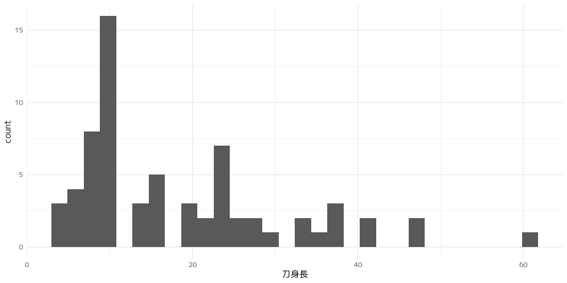

刀身長の分布は10cm、20cm超、40cm前後に峰をもつ3峰分布といえるでしょうか？私たちの予備知識に照らし合わせると、刀子、短刀、脇差クラスに相当する刀身サイズの分化があると推測できます。
ここではこれ以上踏み込みませんが、「分布の形はヒストグラム」というのが鉄則です。

散布図ではだめなのか？
----------------------

2変量が用意できる場合は散布図を用いることも可能と思われるかもしれません。
考古学の論文や発掘調査報告書では、連続量の分布を示す際に散布図を用いているケースが非常に多いと感じます。

下の図は、刀身長と刀身元幅の散布図です。
この図が間違いとは言いませんが、ヒストグラムと比較して、分布の形がわかりやすいと言えるでしょうか？

    iron%>%
        ggplot(aes(x=刀身長,y=刀身元幅))+
        geom_point()+
        theme_minimal()

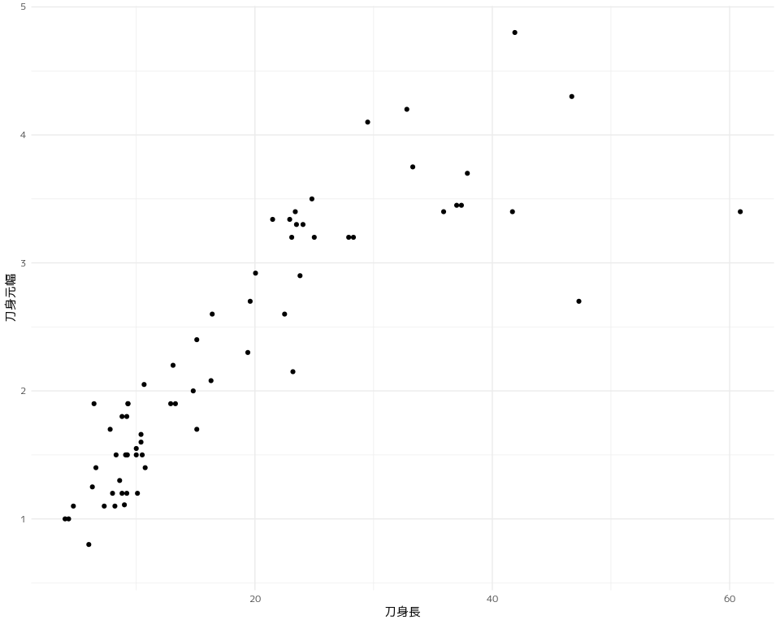

ヒストグラムを使うべき理由
--------------------------

ヒストグラムのもう一つの利点は、分布の形状を数的モデルに近似して比較できることです。
次の図は正規曲線を重ねた刀身長のヒストグラムです。

    # 正規曲線作成のための統計量算出
    iron%>%
        summarise(mean=mean(刀身長,na.rm=T),sd=sd(刀身長,na.rm=T)) -> s_iron
    kable(s_iron)

<table>
<thead>
<tr class="header">
<th style="text-align: right;">mean</th>
<th style="text-align: right;">sd</th>
</tr>
</thead>
<tbody>
<tr class="odd">
<td style="text-align: right;">18.4003</td>
<td style="text-align: right;">12.49029</td>
</tr>
</tbody>
</table>

    # 正規曲線作成
    x<-seq(0, 60, 0.1)
    nom <- x%>%dnorm(mean=s_iron$mean, sd=s_iron$sd)
    nom2<-data.frame(X=x,Y=nom)
    #正規曲線付きヒストグラム
    iron%>%
        ggplot(aes(x=刀身長,y=..density..))+
            geom_histogram()+
            geom_line(data=nom2,aes(x=x,y=Y))+
            scale_colour_ptol()+
            theme_minimal()

    ## `stat_bin()` using `bins = 30`. Pick better value with `binwidth`.

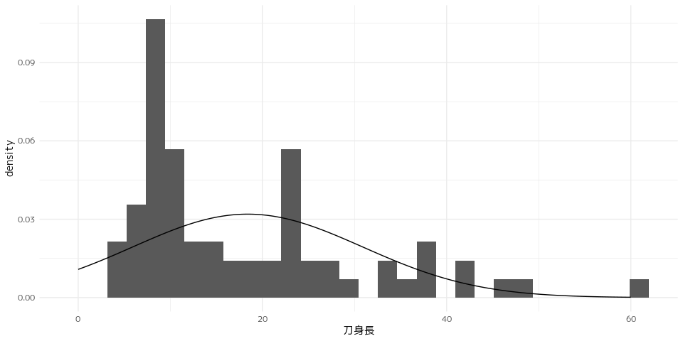

刀身長のヒストグラムと正規分布曲線を重ねることによって、刀身長の分布が正規分布から大きく外れていることがはっきりします。
これは、散布図では絶対に表現できません。
上記のヒストグラムから、古代の刀剣に複数のサイズ規範がある可能性を指摘することはできそうです。

なぜヒストグラムは使われないのだろうか？
----------------------------------------

理由の一つとして、ヒストグラムのもつ「数的モデルとの近似が容易である」という特性を考古学の研究者が活かせていない、ということが考えられます。
例えば正規分布に対する理解や正規分布で近似できるということはどのような意味をもつのか、そのような判断が難しいのだろうと思います。

エクセルでヒストグラム
----------------------

「エクセルでヒストグラムを作りにくい」ということも理由の一つかもしれません。
エクセルでヒストグラムを作れないわけではないのですが、度数分布表から棒グラフを作成することになるので、一手間かかります。

ビン幅の調整をするにも、いちいち度数分布表を作り直さないといけない、ということも面倒です。
こうした理由でヒストグラムが敬遠されるではないかと感じています。

箱ひげ図を用いた連続量の比較
============================

以下の手順でダミーデータを生成します。

    # irisデータ読み込み
    data<-iris
    #ダミーデータ生成
    pot<-data[,c(1,2,5)]
    colnames(pot)<-c("器高","口径","分類")
    pot$分類<-factor(pot$分類,levels=c("setosa","versicolor","virginica"),
        labels=c("A型","B型","C型"))
    pot$器高<-pot$器高*7
    pot$口径<-pot$口径*10
    pot%>%head()%>%kable()

<table>
<thead>
<tr class="header">
<th style="text-align: center;">器高</th>
<th style="text-align: center;">口径</th>
<th style="text-align: left;">分類</th>
</tr>
</thead>
<tbody>
<tr class="odd">
<td style="text-align: center;">35.7</td>
<td style="text-align: center;">35</td>
<td style="text-align: left;">A型</td>
</tr>
<tr class="even">
<td style="text-align: center;">34.3</td>
<td style="text-align: center;">30</td>
<td style="text-align: left;">A型</td>
</tr>
<tr class="odd">
<td style="text-align: center;">32.9</td>
<td style="text-align: center;">32</td>
<td style="text-align: left;">A型</td>
</tr>
<tr class="even">
<td style="text-align: center;">32.2</td>
<td style="text-align: center;">31</td>
<td style="text-align: left;">A型</td>
</tr>
<tr class="odd">
<td style="text-align: center;">35.0</td>
<td style="text-align: center;">36</td>
<td style="text-align: left;">A型</td>
</tr>
<tr class="even">
<td style="text-align: center;">37.8</td>
<td style="text-align: center;">39</td>
<td style="text-align: left;">A型</td>
</tr>
</tbody>
</table>

連続量の分布や差を、離散量ごとに比較します。
連続量と離散量の組み合わせのデータとは、例えば土器分類ごとに口径の分布を確認するようなケースです。次に紹介するように有力な方法がいくつか存在しますが、本命は**箱ひげ図**です。

 

ヒストグラム
------------

    pot%>%
        ggplot(aes(x=口径,fill=分類))+
            geom_histogram()+
            scale_fill_ptol()+
            facet_wrap(~分類,ncol=1,scales="free_y")+
            theme_minimal()

    ## `stat_bin()` using `bins = 30`. Pick better value with `binwidth`.

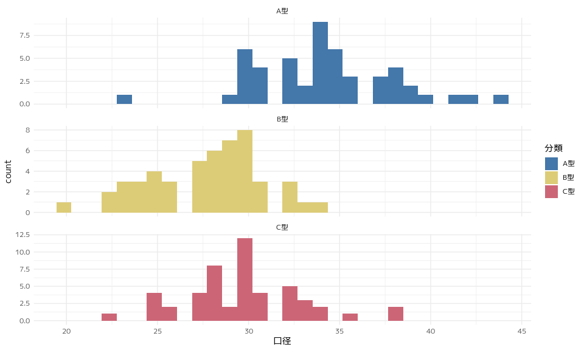

 

密度図
------

    pot%>%
        ggplot(aes(x=口径,fill=分類))+
            geom_density(alpha=0.7)+
            scale_fill_ptol()+
            theme_minimal()

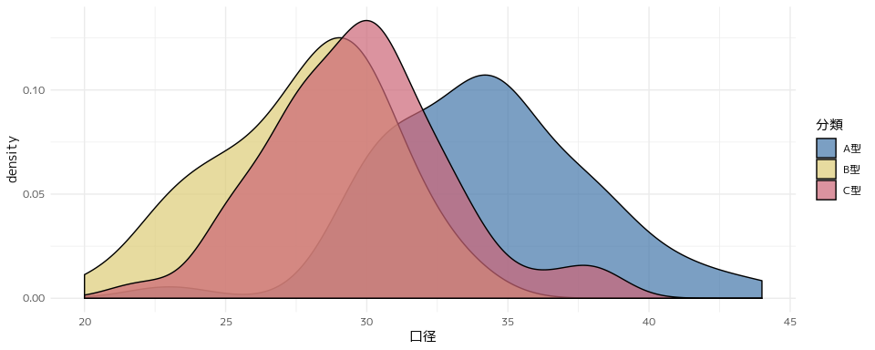

 

箱ひげ図
--------

    library(ggforce)
    pot%>%
        ggplot(aes(x=分類,y=口径,fill=分類))+ 
            geom_boxplot(alpha = 0.2)+      #不透明度を0.2
            geom_sina(aes(colour = 分類),     #geom_sina()関数でaes()の引数にcolour=分類を指定
                  alpha = 0.4, 
                  size = 3) +
            scale_fill_viridis_d() +        #viridis_d(は連続量、離散量ならviridis_c()を指定する
            scale_colour_viridis_d() +
            coord_flip()+
            theme_minimal()

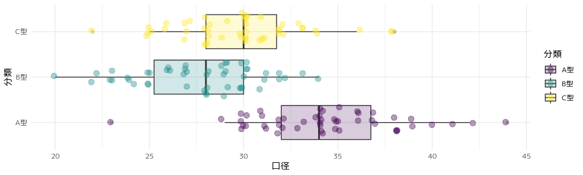

分類ごとの口径の差を確認する目的では箱ひげ図がもっとも敏感に差を可視化してくれます。分布の形状に注目したい場合はヒストグラムや密度図も有力な手法となります。

参考〜多重比較による差の検定〜
------------------------------

箱ひげ図などの可視化手法によって、土器の口径は分類ごとに差がありそうだということがわかりました。
差があるかどうかを定量的に判断するために統計的な検定を行います。

この場合、3つの群に分類されていますので、3つの群同士に差があるかどうかを統計的に確かめることになります。
多群の差の検定手法の一つである「多重比較」を行います。

### 分散分析

最初に分散分析で品種によって差があるかどうかを確認します。
p値が2.2e-16と極めて小さい値をとることから、分類によって差があることがわかります。

    # aov関数の結果をanova関数に渡します。
    # aov関数の第一引数は連続量~離散量
    aov(口径~分類,data=pot)%>% anova()%>%kable(format="markdown")

<table>
<thead>
<tr class="header">
<th style="text-align: left;"></th>
<th style="text-align: right;">Df</th>
<th style="text-align: right;">Sum Sq</th>
<th style="text-align: right;">Mean Sq</th>
<th style="text-align: right;">F value</th>
<th style="text-align: right;">Pr(&gt;F)</th>
</tr>
</thead>
<tbody>
<tr class="odd">
<td style="text-align: left;">分類</td>
<td style="text-align: right;">2</td>
<td style="text-align: right;">1134.493</td>
<td style="text-align: right;">567.24667</td>
<td style="text-align: right;">49.16004</td>
<td style="text-align: right;">0</td>
</tr>
<tr class="even">
<td style="text-align: left;">Residuals</td>
<td style="text-align: right;">147</td>
<td style="text-align: right;">1696.200</td>
<td style="text-align: right;">11.53878</td>
<td style="text-align: right;">NA</td>
<td style="text-align: right;">NA</td>
</tr>
</tbody>
</table>

### TukeyHSD関数で多重比較

次にどの分類同士で差があるのかを調べるために「多重比較」という統計手法を用います。
いずれの分類でも有意な差を確認できます。

    tkh <- 
        aov(口径 ~ 分類, data = pot) %>% 
        TukeyHSD() %>% 
        .$分類 %>%    #TukeyHSD関数の結果から$分類を選択 
        as_tibble() %>%     #tibble_df形式に変換
        mutate_if(is.numeric, round,3)      #mutate_if()でnumericクラスのカラムにround関数を適用する。
    tkh%>%kable(format="markdown")

<table>
<thead>
<tr class="header">
<th style="text-align: right;">diff</th>
<th style="text-align: right;">lwr</th>
<th style="text-align: right;">upr</th>
<th style="text-align: right;">p adj</th>
</tr>
</thead>
<tbody>
<tr class="odd">
<td style="text-align: right;">-6.58</td>
<td style="text-align: right;">-8.189</td>
<td style="text-align: right;">-4.971</td>
<td style="text-align: right;">0.000</td>
</tr>
<tr class="even">
<td style="text-align: right;">-4.54</td>
<td style="text-align: right;">-6.149</td>
<td style="text-align: right;">-2.931</td>
<td style="text-align: right;">0.000</td>
</tr>
<tr class="odd">
<td style="text-align: right;">2.04</td>
<td style="text-align: right;">0.431</td>
<td style="text-align: right;">3.649</td>
<td style="text-align: right;">0.009</td>
</tr>
</tbody>
</table>

棒グラフを賢く使う
==================

器種や分類のような離散量を可視化する場合には棒グラフを用います。北海道内近世後期の遺跡出土の陶磁器組成のデータを用いて構成比のグラフ表現について考えます。

    # データ読み込み
    toj<-read.csv("data/pot.csv")
    # データの順序定義
    toj$器種<-toj$器種%>%
        factor(levels=c("碗","皿","その他食膳具","壺･甕･瓶",
            "土瓶","鍋","すり鉢","灯明皿・油注","その他"))
    toj%>%head()%>%kable()

<table>
<thead>
<tr class="header">
<th style="text-align: left;">遺跡名</th>
<th style="text-align: left;">器種</th>
<th style="text-align: center;">点数</th>
</tr>
</thead>
<tbody>
<tr class="odd">
<td style="text-align: left;">弁天貝塚</td>
<td style="text-align: left;">碗</td>
<td style="text-align: center;">134</td>
</tr>
<tr class="even">
<td style="text-align: left;">弁天貝塚</td>
<td style="text-align: left;">皿</td>
<td style="text-align: center;">84</td>
</tr>
<tr class="odd">
<td style="text-align: left;">弁天貝塚</td>
<td style="text-align: left;">その他食膳具</td>
<td style="text-align: center;">34</td>
</tr>
<tr class="even">
<td style="text-align: left;">弁天貝塚</td>
<td style="text-align: left;">土瓶</td>
<td style="text-align: center;">6</td>
</tr>
<tr class="odd">
<td style="text-align: left;">弁天貝塚</td>
<td style="text-align: left;">鍋</td>
<td style="text-align: center;">0</td>
</tr>
<tr class="even">
<td style="text-align: left;">弁天貝塚</td>
<td style="text-align: left;">すり鉢</td>
<td style="text-align: center;">46</td>
</tr>
</tbody>
</table>

円グラフは使わない
------------------

もっとも大切なことは、**円グラフを使わない**ということです。
人間の目は線の長さや点の位置を把握することには長けていますが、面積の大小や角度を認識するのは苦手です。
円グラフは面積や円の内角で比率を表現することから、適切な可視化手法とはいえません。

    toj_pie<-toj%>%group_by(器種)%>%summarise(点数=sum(点数))
    pie(toj_pie$点数,labels=toj_pie$器種)

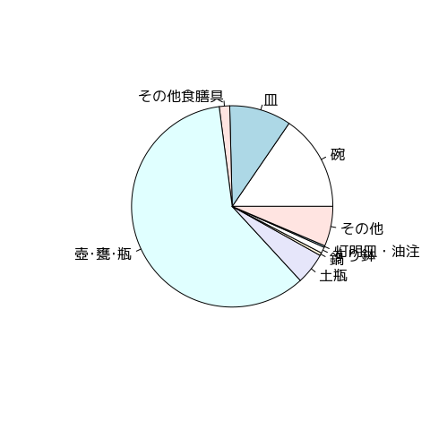

なお、Rで円グラフ（Pie
charts）のヘルプを表示すると次のように記載されています。

Note:

     Pie charts are a very bad way of displaying information.  The eye
     is good at judging linear measures and bad at judging relative
     areas.  A bar chart or dot chart is a preferable way of displaying
     this type of data.

     Cleveland (1985), page 264: “Data that can be shown by pie charts
     always can be shown by a dot chart.  This means that judgements of
     position along a common scale can be made instead of the less
     accurate angle judgements.” This statement is based on the
     empirical investigations of Cleveland and McGill as well as
     investigations by perceptual psychologists.

意訳

円グラフは不適切な可視化手法です。人間の目は直線的な形状の判断には優れていますが、面の比較は苦手です。円グラフで表現できるデータは棒グラフやドットチャートで表現するべきです。

「円グラフで表示できるデータは全てドットチャートで表現できます。円の内角による不正確な判断ではなく、誰もが判断できるモノサシを用いるべきであることを意味しています」（Cleveland
1985,p264）

ダメ！！絶対〜3D円グラフ〜
--------------------------

3D円グラフは目の錯覚を利用して、特定の値を大きく（小さく）見せる**論外**な手法です。公文書や学術的な報告では**絶対に**使うべきものではありません。

構成比棒グラフ
--------------

構成比を比較するために使われるのが構成比棒グラフです。長さや位置によって視覚化されるため、正確な読み取りが可能です。
構成比棒グラフは比率を比較するための優れたグラフ表現です。

    toj%>%
        ggplot(aes(x=遺跡名,y=点数,fill=器種))+
            geom_bar(stat="identity",position="fill")+
            coord_flip()+
            scale_fill_ptol()+
            theme_minimal()

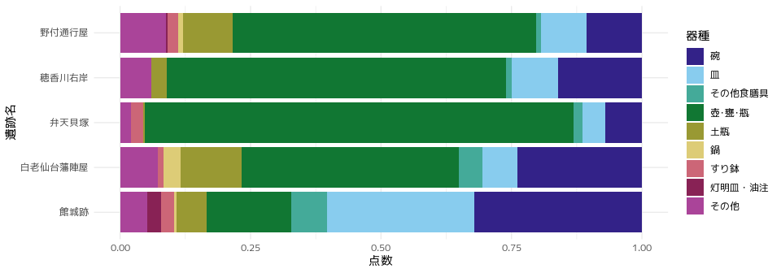

モノクログラフの工夫
--------------------

発掘調査報告書でカラーグラフが掲載できるケースは稀で、大半はグレースケールで表現されることになります。
下のグラフはモニター上ではなんとか識別できますが、オフセット印刷の仕上がりでこれを識別することは不可能です。
凡例との対比は絶望的です。

オフセット印刷の場合、グレスケール（網掛け）は20〜30%スパンが識別できる限界です。したがって、構成比棒グラフでは4群〜5群が表現の限界となります。

    toj%>%
        ggplot(aes(x=遺跡名,y=点数,fill=器種))+
            geom_bar(stat="identity",position="fill")+
            coord_flip()+
            scale_fill_brewer(palette="Greys")+
            theme_minimal()

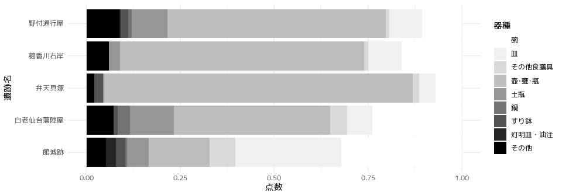

### 解決法1　カテゴリーを減らす

グラフ表現は複雑な現実をシンプルに割り切って視覚的に表現するためのものです。カテゴリー群が多すぎて識別が困難ならば、カテゴリーを減らすことをまずは考えるべきです。
3群まで減らせばオフセット印刷でも識別可能なグレースケールのグラフになります。

    # 食膳具、貯蔵具、その他に区分
    toj2<-toj%>%
        mutate(
            大別器種 = case_when(
                str_detect(器種,"碗|皿|その他食膳具") ~ "食膳具",
                str_detect(器種,"壺･甕･瓶") ~ "貯蔵具",
                str_detect(器種,"灯明皿・油注|その他|すり鉢|鍋|土瓶") ~ "その他",
            )
        )

    # 3区分の構成比棒グラフ
    toj2%>%
        ggplot(aes(x=遺跡名,y=点数,fill=大別器種))+
            geom_bar(stat="identity",position="fill")+
            coord_flip()+
            scale_fill_brewer(palette="Greys")+
            theme_minimal()

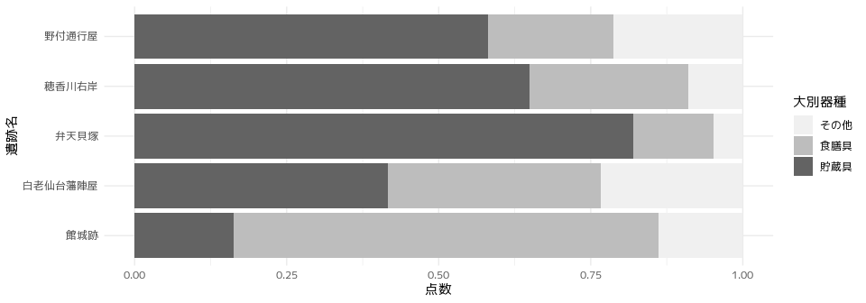

### 解決法2　ファセットされた棒グラフを使う

どうしてもカテゴリー数を減らしたくない場合は、群変数を器種にとって遺跡ごとにファセットします。花粉分析などの分析結果でよく見る形のグラフです。よほどカテゴリーが多くない限り、表現として成立していますし、オフセット印刷原稿としても対応可能です。

    toj%>%
        ggplot(aes(x=器種,y=点数))+
        geom_bar(stat="identity")+
        coord_flip()+facet_wrap(~遺跡名,scales="free")+
        theme_minimal()

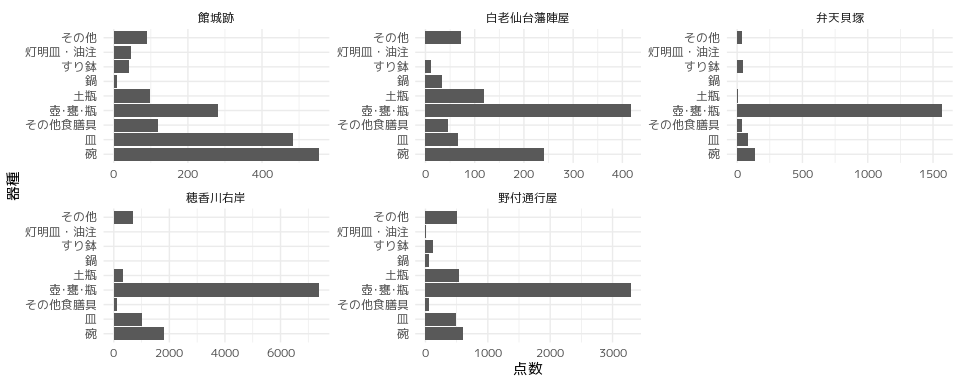

散布図で2変量の関係を可視化する
===============================

散布図は連続量×連続量の組み合わせのデータで用いられます。考古学の論文・報文でもっとも多く使われるグラフ表現かもしれません。
しかし、散布図が最も得意とする「**2変量の関係を可視化する**」という用途に使われることが意外に少ないように思います。

因果関係を可視化する
--------------------

「二変量の関係を可視化する」ことの究極の目的は「因果関係の可視化」です。

たとえば、学力と子どもの生活環境の因果関係を統計的に示すなら、「学力テストの点数」という変量「果」（従属変数）に対して「因」となる変量（独立変数）は「親の収入」や「TVの視聴時間」、「睡眠時間」などが考えられます。

したがって、散布図を描く前に考えることは「因果」の「因」にあたる変量（独立変数）と「果」に当たる変量（従属変数）が何か、ということです。
少なくとも「果」にあたる変量がはっきりしないデータは散布図を描く価値はない、と断言できます。

刀身長と他の属性の関係
----------------------

恵庭西島松5遺跡出土の古代刀剣を対象としたデータを再び使用します。
追求すべきテーマは「刀身長と他の属性との因果関係」です。

刀身の長さは利用価値に即した刀剣サイズを示すものです。
刀剣をつくるときには、刀身長が最初に決まり、刀身長に見合った各部のサイズが決められるものと予想されます。
この場合、因果関係の「果」にあたる変量が刀身長であり、「因」にあたる変量を探索することとなります。

なお、散布図を描く場合の約束として、因果関係の「果」にあたる変量をy軸に、「因」にあたる変量をx軸に割り当てます。
y軸に割り当てられた「果」にあたる変量を**従属変数**、x軸に割り当てられた「因」にあたる変量を**独立変数**と呼びます。

研究集会ではGGallyパッケージを利用して散布図行列を描画しましたが、PerformanceAnalyticsパッケージを利用して有意性の評価を示しています。

    library(PerformanceAnalytics)
    iron %>%
        select(全長, 刀身長, 茎長, 刀身先幅, 刀身元幅, 刀身元厚, 茎先幅) %>%
            chart.Correlation(histogram = TRUE, pch = 19)

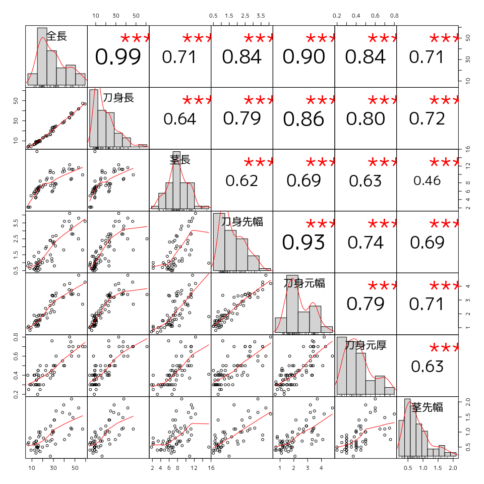

散布図が示すところからは、多くの属性が刀身長と相関関係にあることが読み取れます。
一方、「刀身元幅」のように非常に強い相関を示す変量もあれば、「茎先幅」のように相関が弱い変量もあります。
刀身長との相関の強弱を判断することで、古代剣製作にかかる規範意識を読み取ることが可能かもしれません。

予測する
--------

散布図を作成する目的は2変量の因果関係を考えることでした。因果関係がわかるということは**予測**ができるということです。次は古代刀剣の刀身元幅から刀身長を予測することを検討します。出土刀剣では刀身が破損せずに出土することはまれですから、元幅から刀身長を予測できれば、出土刀剣の把握に大きな成果がありそうです。

    p<-iron%>%
        ggplot(aes(x=刀身元幅,y=刀身長))+
            geom_point()+
            geom_smooth(method="lm")+
            theme_minimal()

なお、刀身元幅を独立変数とする刀身長の予測式は次のとおりです。

    icoe<-lm(刀身長 ~ 刀身元幅,data=iron)%>%summary()
    icoe$coefficients%>%kable()

<table>
<thead>
<tr class="header">
<th></th>
<th style="text-align: right;">Estimate</th>
<th style="text-align: right;">Std. Error</th>
<th style="text-align: right;">t value</th>
<th style="text-align: right;">Pr(&gt;|t|)</th>
</tr>
</thead>
<tbody>
<tr class="odd">
<td>(Intercept)</td>
<td style="text-align: right;">-6.280888</td>
<td style="text-align: right;">1.9780720</td>
<td style="text-align: right;">-3.175257</td>
<td style="text-align: right;">0.0022892</td>
</tr>
<tr class="even">
<td>刀身元幅</td>
<td style="text-align: right;">10.723991</td>
<td style="text-align: right;">0.7889999</td>
<td style="text-align: right;">13.591878</td>
<td style="text-align: right;">0.0000000</td>
</tr>
</tbody>
</table>

y=10.72x-6.28

    library(ggpmisc)

    ## For news about 'ggpmisc', please, see https://www.r4photobiology.info/

    iron %>%
        ggplot(aes(x=刀身元幅,y=刀身長))+
            geom_point()+
            geom_smooth(method="lm")+
            theme_minimal() +
            stat_poly_eq(formula = y ~ x,
                eq.with.lhs = "italic(hat(y))~`=`~",
                aes(label = paste(stat(eq.label), 
                    stat(rr.label), 
                    sep = "~~~")
                ), parse = TRUE
            ) +
            stat_fit_glance(label.y = 0.9,
                method = "lm",
                method.args = list(formula = y ~ x),
                aes(label = sprintf(
                    '~~italic(P)~"="~~%.25f',
                    stat(p.value)
                    )
                ),parse = TRUE
            )

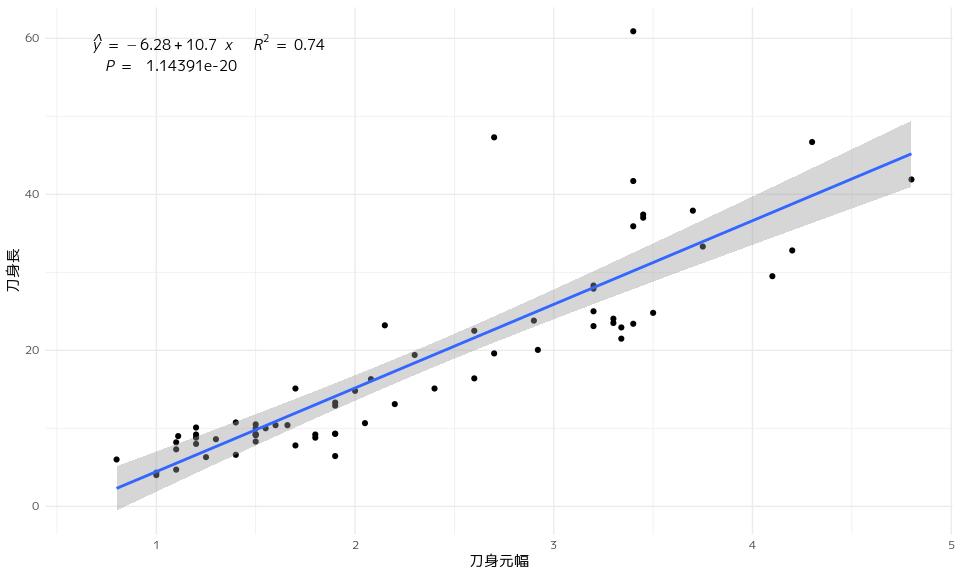

 この
記事 は
<a rel="license" href="http://creativecommons.org/licenses/by/4.df0/">クリエイティブ・コモンズ
表示 4.0 国際 ライセンスの下に提供されています。</a>
