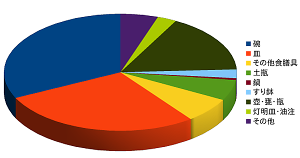
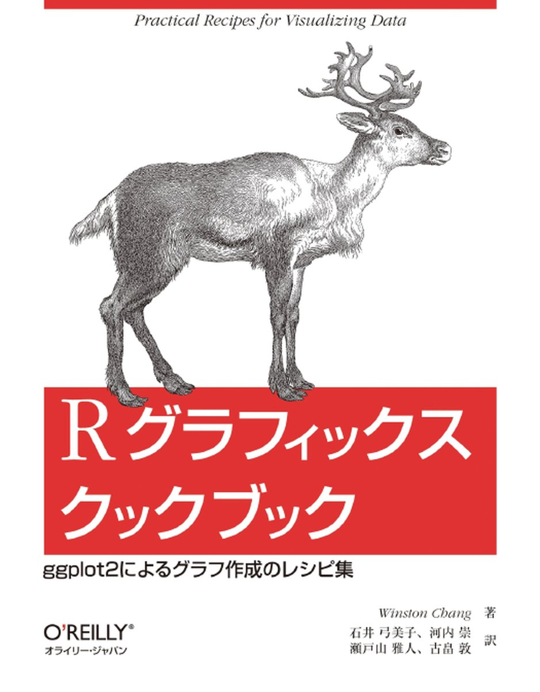
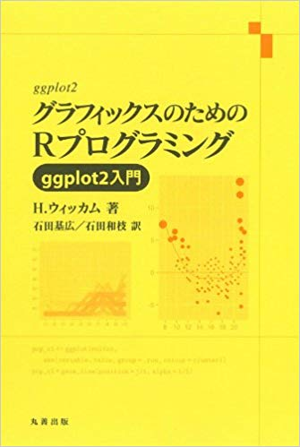
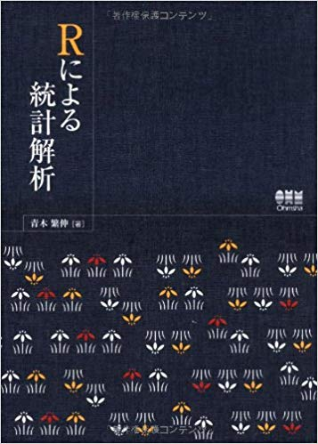

```{r warning=FALSE,error=FALSE,echo=FALSE}
# パッケージ読み込み
library(tidyverse)
library(ggthemes)
library(knitr)
library(rmarkdown)
library(revealjs)
```

## 覚えるべき用語

<br>

### 連続量

- 数字で表される属性
- 土器の口径、器高、石器の刃部長や重量

<br>

### 離散量

- 何らかの分類
- 記号で表される属性
- 土器の分類、石器の器種


## <br>変数の性質と可視化手法

<br>
<br>

```{r warning=FALSE,error=FALSE,message=FALSE,fig.width=10, fig.height=7,echo=FALSE}
read.csv("data/method.csv")%>%kable()

```

# <br><br>ヒストグラムで連続量を可視化する
 
## <br>連続量のデータ

<br>

- 「分布の形」を確認する
- ヒストグラムを描く

## 刀身長の分布

北海道恵庭市西島松5遺跡出土の奈良時代の刀剣類のデータ

<br>

```{r warning=FALSE,error=FALSE,echo=FALSE}
iron<-read.csv("data/iron.csv")
iron[,c(4:12)]%>%head()%>%kable()
```

## 

刀身長は複数にサイズ分化がありそうだ

```{r fig.width=10, fig.height=5,warning=FALSE,error=FALSE,message=FALSE,echo=FALSE}
p<-iron%>%
	ggplot(aes(x=刀身長))+
	geom_histogram()+
	theme_minimal()
print(p)

```

## 散布図ではだめなのか？

分布の形を観察するには適切でない

```{r fig.width=8, fig.height=5,warning=FALSE,error=FALSE,echo=FALSE}
p<-iron%>%
	ggplot(aes(x=刀身長,y=刀身元幅))+
	geom_point()+
	theme_minimal()
print(p)
```

## ヒストグラムを使うべき理由

分布の形状を数的モデルで近似

```{r fig.width=10, fig.height=5,warning=FALSE,error=FALSE,echo=FALSE,message=FALSE}
# 正規曲線作成のための統計量算出
iron%>%
	summarise(mean=mean(刀身長,na.rm=T),sd=sd(刀身長,na.rm=T)) -> s_iron
# 正規曲線作成
x<-seq(0, 60, 0.1)
nom <- x%>%dnorm(mean=s_iron$mean, sd=s_iron$sd)
nom2<-data.frame(X=x,Y=nom)
#正規曲線付きヒストグラム
p<-iron%>%
	ggplot(aes(x=刀身長,y=..density..))+
		geom_histogram()+
		geom_line(data=nom2,aes(x=x,y=Y))+
		scale_colour_ptol()+
		theme_minimal()
print(p)
```

## <br>敬遠されがちヒストグラム

<br>
<br>

- 「数的モデルとの近似が容易である」という特性を活かせていない
-  正規分布で近似できることの意味がわかりにくい

## <br>エクセルでヒストグラム

<br>

- エクセルでヒストグラムを作りにくい
- 度数分布表から棒グラフを作成
- 度数分布表から作り直さなければならない


# <br><br>箱ひげ図を用いた比較


```{r warning=FALSE,error=FALSE,message=FALSE,fig.width=10, fig.height=7,echo=FALSE}
# irisデータ読み込み
data<-iris
#ダミーデータ生成
pot<-data[,c(1,2,5)]
colnames(pot)<-c("器高","口径","分類")
pot$分類<-factor(pot$分類,levels=c("setosa","versicolor","virginica"),
	labels=c("A型","B型","C型"))
pot$器高<-pot$器高*7
pot$口径<-pot$口径*10
pot%>%head()%>%kable()
```

## <br>連続量と離散量の組み合わせ

<br>

- 分類ごとにサイズの分布を確認する
- 有力な方法が複数存在
- 本命は**箱ひげ図**

## ヒストグラム

ヒストグラムを離散量でファセット

```{r fig.width=10, fig.height=5,warning=FALSE,error=FALSE,echo=FALSE,message=FALSE}
p<-pot%>%
	ggplot(aes(x=口径,fill=分類))+
		geom_histogram()+
		scale_fill_ptol()+
		facet_wrap(~分類,ncol=1,scales="free_y")+
		theme_minimal()
print(p)
```


## 密度図

<br>

```{r fig.width=10, fig.height=5,warning=FALSE,error=FALSE,echo=FALSE}
p<-pot%>%
	ggplot(aes(x=口径,fill=分類,alpha=0.7))+
		geom_density()+
		scale_fill_ptol()+
		theme_minimal()
print(p)
```

<br>

## 箱ひげ図

<br>

```{r fig.width=10, fig.height=4,warning=FALSE,error=FALSE,echo=FALSE}
p<-pot%>%
	ggplot(aes(x=分類,y=口径,fill=分類))+
		geom_boxplot()+
		scale_fill_ptol()+
		coord_flip()+
		theme_minimal()
print(p)
```

## <br>可視化手法とその性質

<br>

- 分類ごとの差を可視化する目的には**箱ひげ図**がもっとも有効
- 分布の形状に注目したい場合はヒストグラムや密度図


# <br><br>棒グラフをかしこく使う

## <br>近世陶磁器組成

<br>

北海道内近世後期の陶磁器組成データ

```{r  fig.width=8, fig.height=6,warning=FALSE,error=FALSE,echo=FALSE}
# データ読み込み
toj<-read.csv("data/pot.csv")
# データの順序定義
toj$器種<-toj$器種%>%
	factor(levels=c("碗","皿","その他食膳具","壺･甕･瓶",
		"土瓶","鍋","すり鉢","灯明皿・油注","その他"))
toj%>%head()%>%kable()
```

## <br>棒グラフの特性

<br>

- 離散量を表現する手法
- 遺跡ごとあるいは住居跡ごとに出土遺物の構成比を調べる
- 離散量（遺跡名）と離散量（器種）の組み合わせによるデータの可視化

## 円グラフは使わない

人間の目は面積の大小を認識するのは苦手

```{r  fig.width=5, fig.height=5,warning=FALSE,error=FALSE,echo=FALSE}
toj_pie<-toj%>%group_by(器種)%>%summarise(点数=sum(点数))
pie(toj_pie$点数,labels=toj_pie$器種)
```

## Rのヘルプでも・・・

<br>

円グラフは不適切な可視化手法です。人間の目は直線的な形状の判断には優れていますが、面の比較は苦手です。円グラフで表現できるデータは棒グラフやドットチャートで表現するべきです。

<br>

「円グラフで表示できるデータは全てドットチャートで表現できます。円の内角による不正確な判断ではなく、誰もが判断できるモノサシを用いるべきであることを意味しています」（Cleveland）

## 使ってはいけないグラフ

<br>

- 3D円グラフは目の錯覚を利用する手法
- 公文書や学術的な報告では**絶対**に使うべきではない



## <br>構成比棒グラフ

比率を可視化する優れたグラフ表現

```{r  fig.width=10, fig.height=3.5,warning=FALSE,error=FALSE,echo=FALSE}
p<-toj%>%
	ggplot(aes(x=遺跡名,y=点数,fill=器種))+
		geom_bar(stat="identity",position="fill")+
		coord_flip()+
		scale_fill_ptol()+
		theme_minimal()
print(p)
```

## グレースケールの悲哀

- オフセット印刷の場合、グレスケール（網掛け）は20〜30%スパンが識別できる限界
- ぎりぎり4群〜5群

```{r  fig.width=10, fig.height=3.5,warning=FALSE,error=FALSE,echo=FALSE}
p<-toj%>%
	ggplot(aes(x=遺跡名,y=点数,fill=器種))+
		geom_bar(stat="identity",position="fill")+
		coord_flip()+
		scale_fill_brewer(palette="Greys")+
		theme_minimal()
print(p)
```

## 解決法A　カテゴリーを減らす

<br>

カテゴリーは3群をめざす

```{r  fig.width=10, fig.height=3.5,warning=FALSE,error=FALSE,echo=FALSE}
# 食膳具、貯蔵具、その他に区分
toj2<-toj%>%
	mutate(大別器種 = case_when(
		grepl("碗",器種)|grepl("皿",器種)|grepl("その他の食膳具",器種)	 == TRUE ~ "食膳具",
		grepl("壺･甕･瓶",器種) == TRUE ~ "貯蔵具",
		grepl("灯明皿・油注",器種)|grepl("その他",器種)|grepl("すり鉢",器種)|
			grepl("鍋",器種)|grepl("土瓶",器種) == TRUE ~ "その他",
		))
# 3区分の構成比棒グラフ
p<-toj2%>%
	ggplot(aes(x=遺跡名,y=点数,fill=大別器種))+
		geom_bar(stat="identity",position="fill")+
		coord_flip()+
		scale_fill_brewer(palette="Greys")+
		theme_minimal()
print(p)
```

## 解決法B　ファセットする

<br>

花粉分析などでよく見る形のグラフ

```{r  fig.width=10, fig.height=4,warning=FALSE,error=FALSE,echo=FALSE}
p<-toj%>%
	ggplot(aes(x=器種,y=点数))+
	geom_bar(stat="identity")+
	coord_flip()+facet_wrap(~遺跡名,scales="free")+
	theme_minimal()
print(p)
```

# <br><br>散布図で関係を可視化する

## <br>散布図の目的

<br>

- 連続量×連続量の組み合わせのデータ
- 2変量の関係を可視化する
- つまり因果関係を可視化する

## <br>刀身長と他の属性の関係

<br>

- 恵庭西島松5遺跡出土の古代刀剣データ
- 追求すべきテーマは「刀身長と他の属性との因果関係」
- 刀身長を予測可能な変量はなにか？

## 

```{r fig.width=10, fig.height=7,warning=FALSE,error=FALSE,message=FALSE,echo=FALSE}
# GGallyパッケージ読み込み
library(GGally)
#
p<-iron%>%select(全長,刀身長,茎長,刀身先幅,刀身元幅,刀身元厚,茎先幅)%>%
	ggpairs(diag=list(continuous="barDiag"))
print(p)
```

## 刀身元幅から刀身長を予測する

```{r fig.width=10, fig.height=6,warning=FALSE,error=FALSE,echo=FALSE}
p<-iron%>%
	ggplot(aes(x=刀身元幅,y=刀身長))+
		geom_point()+
		geom_smooth(method="lm")+
		theme_minimal()
print(p)
```

## <br>刀身長の予測式

<br>

```{r fig.width=10, fig.height=6,warning=FALSE,error=FALSE,echo=FALSE}
icoe<-lm(刀身長 ~ 刀身元幅,data=iron)%>%summary()
icoe$coefficients%>%kable()
```

<br>

y=10.72x-6.28

# <br><br>まとめ

## <br>データの型をみきわめる

<br>

- データの型と組み合わせ
- 連続量と離散量

## 辞書代わり



Rグラフィックスクックブック ggplot2によるグラフ作成のレシピ集

（Winston Chang,オライリージャパン）

## 読み物として



グラフィックスのためのRプログラミング

（Hadley Wickham,丸善出版）

## 基本操作と統計手法



Rによる統計解析

（青木繁伸,オーム社）


```{r echo=FALSE,eval=FALSE}
# revealjsスライド
render("index.Rmd",revealjs::revealjs_presentation(theme="league",transition="slide"),"index.html")
```


